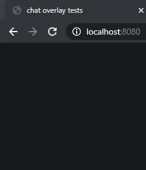

# chat-overlay

simple on-screen twitch chat, supports twitch badges, twitch and bttv emotes  

  

## Install

### tokens

create `tokens.json`, attributes: channel, twitch_bot_token, channel_id (or client_id)  

`channel` - twitch username in lower case  
`twitch_bot_token` - OAuth token with `chat:read` scope, [twitchapps](https://twitchapps.com/tokengen/) helps obtain  

for bttv emotes:  

`channel_id` - if omitted, obtained automatically using `client_id`  
`client_id` - twitch application client id, create app in [twitch dev console](https://dev.twitch.tv/console/apps)  

### server

run server, add browser source in obs  

Node.js http-server:  

    npm install http-server -g
    cd chat-overlay
    http-server

### globals

`max_messages` (integer): max number of messages on screen at once  
`ignoredUsers` (array of strings): twitch usernames in lower case, ignored user's messages not displayed  
`badges` (boolean): show badges?  
`bttv` (boolean): fetch and display bttv emotes?  
